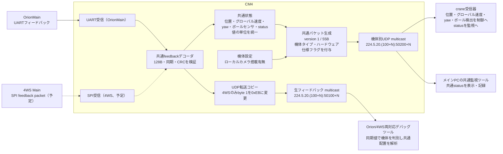

# CM4からcrane・メインPCへ送る共通状態パケット（仮仕様）

## 目的と範囲

craneが制御に使う位置・グローバル速度・ボール検出・yawと、監視に使う温度・電圧・電流・エラーを、CM4が固定の形式に変換して送る。Mainの共通feedback packetを変更しても、craneとメインPCはその配置を解釈しない。変換はCM4に閉じ込める。

この文書は**仮仕様**であり、共通パケット生成・crane側の受信・メインPCの共通監視ツール・4WS Mainの生データ配信は未実装。両機種のfeedback packetは[フィードバックパケット](feedback_packet.md)、4WSの転送方針は[4WS MainとのSPI通信案](4ws_spi_packet_proposal.md)に記す。

## 送信データのブロック図

ローカルカメラのボール検出はCM4内部のmode 7・8制御で使う別入力である。このパケットの`ball_detect`は**機体のボールセンサ**を表し、カメラの検出結果とは混ぜない。
`hardware_flags`のカメラ搭載ビットはハードウェア構成を表し、カメラの稼働状態やボール検出状態では変化しない。
OrionMainのUARTは現在の受信処理1か所で読み、検証後に診断配信と共通状態への変換を分岐させる。4WSのSPIでも同じfeedbackデコーダを使う。

## CM4からの送信系統とPCツール

| 送信内容 | multicast先 | 受信側 | 実装状況と変更の扱い |
| --- | --- | --- | --- |
| 共通状態（55バイト） | `224.5.20.(100+N):50200+N` | crane、Orion/4WS共通のメインPC監視ツール | 未実装。機体側の変更はCM4の変換で吸収し、共通形式を安定させる |
| OrionMainの生フィードバック | `224.5.20.(100+N):50100+N` | 両対応デバッグツール | 配信あり。UDP同期値は`0xAB 0xEA` |
| 4WS Mainの生フィードバック | `224.5.20.(100+N):50100+N` | 両対応デバッグツール | 配信は未実装。UDP転送コピーの同期値は`0xAB 0xEB` |

1台のCM4に接続するMainは設定で1種類に確定するため、生フィードバックは機体タイプごとにポートを増やさない。Main→CM4はどちらも[共通の128バイトfeedback packet](feedback_packet.md)で同期値は`0xAB 0xEA`。CM4は長さ・同期・CRCを検証して共通状態への変換と生データ配信へ分岐する。OrionMainはフレームをそのまま配信する。4WSではUDP転送コピーのbyte 1だけを`0xEB`に変え、デバッグツールが機体を判別できるようにする。CRC対象はbyte 3..127なので再計算は不要である。

メインPCの共通監視ツールは生フィードバックを購読しない。`robot-feedback-receiver`と`robot-feedback-viewer`はOrionMainと4WS Mainの生データを扱うデバッグツールであり、機体タイプを判別した後は共通のfeedback配置を使う。4WS MainのSPI通信とCM4からの配信は未実装である。共通状態パケット自体の意味を変える場合だけ、`version`を更新して共通監視ツールとcraneの受信処理を揃える。

## 通信と受信規則

- 機体番号を`N`とし、送信先は`224.5.20.(100+N):50200+N`とする。craneとメインPCの共通監視ツールは同じグループへ参加する。Mainの生フィードバック`50100+N`とはポートを分ける。
- 有効な機体側の状態を1件受けるごとに1件送る。入力が途絶えた場合、最後の値を新しいパケットとして繰り返さない。受信側は到着時刻を基準に100 msを超えた状態を制御に使わない。送信周期は機体側の状態更新に従い、固定周期を要求しない。
- UDPの送信先ポートでこのパケットを識別する。受信側は56バイト以上のバッファを用意し、`recvfrom`等で得たデータ長が55バイトであること、`version`が1であること、`machine_type`が定義済みの値であることを確認する。機体番号は参加したmulticastグループとポートで識別する。送信側はUDPチェックサムを有効にする。
- ペイロード内にmagic、長さ、機体番号、独自CRC、連番、送信時刻、予約バイトは設けない。ポート・受信長・UDPチェックサムで確認できる情報を重複させず、鮮度は受信側の到着時刻で判定する。
- 位置・グローバル速度・yaw・ボール検出が揃い、かつ数値が有限である場合に送信する。いずれかが取得できない場合は共通パケットを生成しない。craneは受信鮮度を確認して制御に使う。
- 機体側の長さ・同期・CRCが不正な場合も共通パケットを生成しない。FWゲートウェイ応答で位置・速度領域を使用している間も送信しない。
- 温度を持たない箇所は0で埋める。温度は高温の判定にだけ使用し、0を実測値や正常動作の証明として扱わない。その他のstatus項目は送信前に取得できることを前提とする。

## ペイロード案

UDPペイロードは55バイト固定。整数はlittle-endian、浮動小数点はIEEE 754 binary32のlittle-endian。値の単位と意味は機体側のパケット配置に依存させない。

| byte | 項目 | 形式・意味 |
| --- | --- | --- |
| 0 | `version` | `uint8`、初版は1 |
| 1 | `machine_type` | `uint8`、`1=OrionMain`、`2=4WS` |
| 2 | `hardware_flags` | `uint8`、bit 0はCM4接続ローカルカメラの搭載有無 |
| 3..6 | `position_x` | `float32`、フィールド座標[m] |
| 7..10 | `position_y` | `float32`、フィールド座標[m] |
| 11..14 | `velocity_x` | `float32`、フィールド座標系の速度[m/s] |
| 15..18 | `velocity_y` | `float32`、フィールド座標系の速度[m/s] |
| 19..22 | `yaw` | `float32`、フィールド座標の姿勢[rad]、`[-π, π)` |
| 23 | `ball_detect` | `uint8`、機体ボールセンサの検出を0/1で表す |
| 24..25 | `error_id` | `uint16`、機体の現在のエラーID。エラーなしは0 |
| 26..27 | `error_info` | `uint16`、`error_id`に対応する補足値 |
| 28..31 | `error_value` | `float32`、`error_id`に対応する測定値 |
| 32..35 | `battery_voltage` | `float32` [V] |
| 36..39 | `capacitor_voltage` | `float32` [V] |
| 40..43 | `drive_motor_temp[4]` | `uint8`×4、各輪のモーター温度[°C] |
| 44..47 | `steering_motor_temp[4]` | `uint8`×4、各輪のステアモーター温度[°C] |
| 48 | `fet_temp` | `uint8`、電源基板のFET温度[°C] |
| 49..50 | `coil_temp[2]` | `uint8`×2、電源基板のコイル温度[°C] |
| 51..54 | `drive_motor_current[4]` | `uint8`×4、0.1 A/LSB |

`version`はポートによるパケット種別の識別とは別に、同じポートで受けた共通パケットの配置を判定するために残す。配置や意味を変える場合は値を更新し、未対応の受信側は破棄する。
`machine_type`は機体番号とは独立した駆動機構の種類を表す。CM4の機体設定から決定し、OrionMain接続機は`OrionMain=1`、4WS Main接続機は`4WS=2`を送る。未定義の値は受信側で破棄する。
`hardware_flags`はbit 0のみ定義する。`1`はCM4にローカルカメラを搭載、`0`は非搭載を表す。送信側はbit 1..7を0にし、受信側はこれらのビットを無視する。搭載機でカメラが停止・故障していてもbit 0は1のままとする。

Orionにステアモーターがない場合は`steering_motor_temp[4]`を0にする。エラー情報の意味は共通のエラーID定義ができるまでは機体依存とし、craneは0/非0と表示用の数値として扱う。

`yaw`は位置と同じフィールド座標に合わせる。OrionMainの`imu_yaw_deg`はCM4で角度単位と原点を変換する。フィールド原点との対応が確定できない場合は共通パケットを送信しない。

OrionMain受信アダプタでは、`vision_based_position_x/y`を位置、`global_odom_speed_x/y`をグローバル速度、`ball_detection[0]`を`ball_detect`、`imu_yaw_deg`をyawの入力候補とする。電圧・温度・電流・エラーは[フィードバックパケット](feedback_packet.md)の同名フィールドから変換する。

## 変更時の担当範囲

| 変更内容 | 更新する範囲 |
| --- | --- |
| 共通feedback packetの配置や物理単位 | 両機種のMain送信処理、CM4の共通デコーダ、デバッグツールの共通デコーダ |
| 4WSのSPI転送手順 | CM4と4WS MainのSPI送受信処理 |
| 共通パケットの意味・配置 | CM4の送信処理とcrane・メインPCの受信処理。`version`を更新する |

craneの制御・監視とメインPCの共通監視ツールは共通パケットだけに依存させる。
